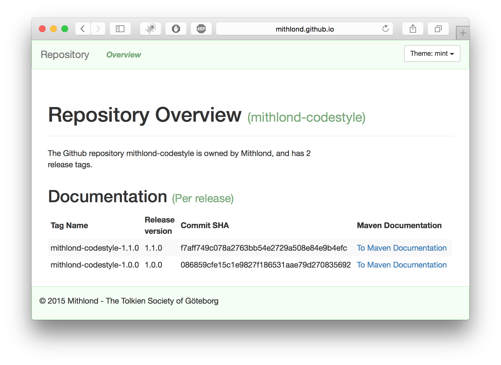

# [1. Mithlond: Codestyle](http://mithlond.github.io/mithlond-codestyle)

The Mithlond: Codestyle project structure contains parent POMs and codestyle 
definitions with best practises for collaborative development.

[](https://travis-ci.org/Mithlond/mithlond-codestyle)

The reactor consists has 3 main strucures:

1. **poms**. All parent poms for artifact projects (i.e. projects which produce JARs, WARs, EARs, 
   or assemblies) are located here. This structure provides simpler release management using Maven's 
   standard mechanics, as well as a means to change versions or build process for a set of projects 
   with similar needs - for example all Model or API projects - in a single file.
 
2. **codestyle**. All configuration for plugins handling code quality or introspection, as well as
   any custom validation/enforcement rules are placed within this project. Also holds license definitions and
   related header and template files.
   
3. **appserver overlays**. Getting the basic infrastructure ready for running on an application server
   can be a daunting task in itself. The overlays here are meant to be unpacked in (the root of) a vanilla
   application installation to create a fully operating application server.
          
## 1.1. Release Documentation

Release documentation (including Maven site documentation) can be found
at [The Mithlond: Codestyle Documentation Site](http://mithlond.github.io/mithlond-codestyle). 
Select the release version you are interested in, to find its full Maven site documentation.
A screenshot of the landing page is shown below at a particular point in time:



# 2. Getting and building mithlond-codestyle

The mithlond-codestyle is a normal Git-based Maven project. 
It is simple to get and build it. 

## 2.1. Getting the repository

Clone the repository, and fetch all tags:

```
git clone https://github.com/Mithlond/mithlond-codestyle.git

cd mithlond-codestyle

git fetch --tags
```

## 2.2. Building the Codestyle project

For the latest development build, simply run the build against the latest master branch revision:  

```
mvn clean install
```

For a particular version, checkout its release tag and build normally:
 
```
git checkout mithlond-codestyle-1.0.1

mvn clean install
```

All tags (and hence also all release versions) are visible using the command
 
```
git tag -l
```

### 2.2.1. Building with different Maven versions

For building the project with another Maven version, simply run the following 
script, where the `${MAVEN_VERSION}` should be substituted for a version number
such as `3.3.3`:
  
```
mvn -N io.takari:maven:wrapper -Dmaven=${MAVEN_VERSION}

./mvnw --show-version --errors --batch-mode validate dependency:go-offline

./mvnw --show-version --errors --batch-mode clean verify site
```

In the windows operating system, use `mvnw.bat` instead.


